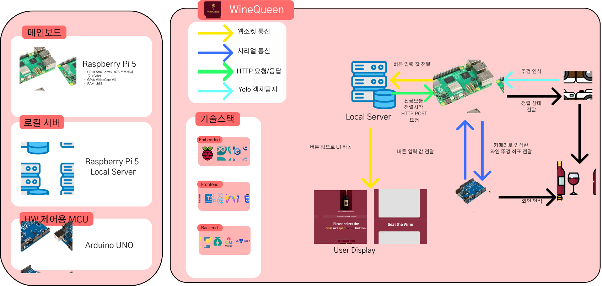
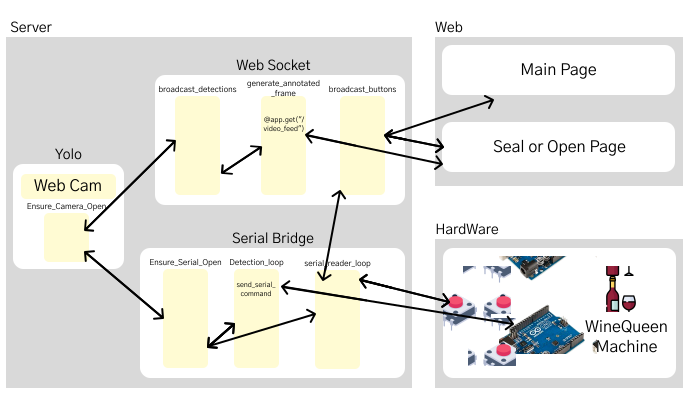
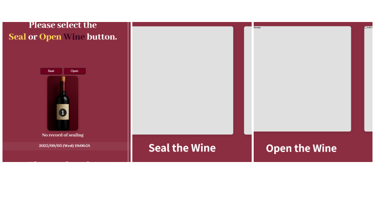

# 2025ESWContest_free_1091

## 🔖 Intro

WINEQUEEN은 **버튼 한 번**으로 와인병을 자동 밀봉·진공 보관하는 디바이스입니다.  
YOLO 비전 + 로봇팔 + 기압 센서 피드백 제어로, 마지막 한 방울까지 신선하게 보관합니다.

## 💡 Inspiration

개봉 후 와인은 공기 접촉으로 빠르게 산화됩니다. 수동 펌핑·스토퍼는 번거롭고 진공 품질이 일정하지 않아 신선도 유지에 한계가 있죠.  
“**더 간편하고, 더 완벽하게 보관할 수 없을까?**”라는 질문에서 WINEQUEEN은 시작되었습니다.

## 📸 Overview



<br>

1. 사용자가 와인병을 거치
2. 사용자가 디스플레이를 보며 아두이노 개봉 or 밀봉 버튼을 작동한다.
3. 카메라로 병·뚜껑 위치 인식 (YOLO)
4. 로봇팔이 뚜껑 픽업 → 병 입구 정렬
5. Z축 하강으로 뚜껑 삽입
6. 진공 노즐 위치 정렬
7. 진공 펌프 ON → 기압 센서로 목표 압력 도달 확인
8. 펌프 OFF 및 초기 위치 복귀
9. UI에 진행 상태 표시 후 메인 페이지로 복귀

## 👀 Main feature

- ### 1️⃣ AI 모델로 병·뚜껑 정렬

  온디바이스 실시간 동작을 위해 320×320 입력으로 경량 YOLOv8을 사용합니다.  
  외부 이벤트(버튼/센서) 기반으로만 추론을 수행해 불필요한 연산을 줄이고, **뚜껑 중심점/병 입구**를 검출해 X축 미세 이동으로 정렬합니다.

- ### 2️⃣ 디바이스 동작 (State Machine)

  #### 1. 뚜껑 픽업 & 정렬

  <br>
  <details>
    <summary>state 상세설명 ⏬</summary>

  - **PICK_CAP**  
    전자석 ON → 뚜껑 보관소로 이동 → Z 하강 픽업 → 상승.
  - **FIND_BOTTLE**  
    병 예상 위치로 이동, 카메라 시야 내 대상 확보.
  - **ALIGN_CENTER**  
    YOLO 중심 오차를 계산하여 X축 미세 이동 반복 → 중앙 정렬 완료(ACK).
  - **INSERT_CAP**  
   Z 하강으로 뚜껑 삽입 → 전자석 OFF → Z 상승.
  </details>

  #### 2. 진공 시퀀스

  <br>
  <details>
    <summary>state 상세설명 ⏬</summary>

  - **MOVE_TO_NOZZLE**  
    진공 노즐 위치 정렬 → Z 하강 밀착.
  - **VACUUM_ON**  
    펌프 ON, 기압 센서 스트리밍으로 목표치 도달 감시.
  - **HOLD/STOP**  
    목표 압력 도달 시 펌프 OFF → 안정화 대기(소정 시간/히스테리시스).
  - **RETURN_HOME**  
   Z 상승, 로봇팔 홈 복귀 → 완료 신호 전송.
  </details>

  #### 3. 개봉(Release) 시퀀스

  <br>
  <details>
    <summary>state 상세설명 ⏬</summary>

  - **ALIGN_CENTER**  
    병 입구 정렬(동일 방식).
  - **EQUALIZE_PRESSURE**  
    릴리즈 밸브 개방으로 내부 압력 정상화 확인.
  - **REMOVE_CAP**  
   전자석으로 뚜껑 픽업 → 보관소로 이동해 해제.
  </details>

- ### 3️⃣ 서버 및 디스플레이

  #### 1. 서버(FastAPI, OpenCV)

  

  <br>
  <details>
    <summary>백엔드 module 상세설명 ⏬</summary>

  - **API(Controller)**: REST/WebSocket 엔드포인트, 상태 조회·명령 수신.
  - **YOLO Inference**: 프레임 캡처, 추론, 중심 오차 계산.
  - **Control Logic**: 정렬/시퀀스 상태 머신, 타이밍·안전 인터록.
  - **Serial Bridge**: Arduino(UART)와 명령/ACK 교환, 버튼 동작 전달, 재시도·타임아웃.
  - **Pressure Monitor**: 목표 압력 도달, 히스테리시스, 이동평균 필터.
  </details>
  <details>
    <summary>함수 상세설명 ⏬</summary>

  ### 1) Ensure_Camera_Open (`ensure_camera_open`)

  - **역할**: 카메라 장치 오픈 및 해상도(640×480) 설정.
  - **호출 위치**: `detection_loop()` 루프 내(닫혀 있으면 재오픈 시도).

  ***

  ### 2) broadcast*detections *(async task)\_

  - **역할**: 최신 감지 JSON(`latest_detections_json`)을 모든 WebSocket 클라이언트로 **주기(100ms)** 브로드캐스트.
  - **호출 위치**: FastAPI `lifespan`에서 `asyncio.create_task(...)`.
  - **입력/출력**: 공유 버퍼에서 읽음 / WS 텍스트 프레임 전송.

  ***

  ### 3) generate*annotated_frame *(generator)\_

  - **역할**: 최신 주석 프레임(`latest_annotated_frame`)을 **MJPEG** 스트림 조각으로 생성.
  - **호출 위치**: `GET /video_feed`에서 `StreamingResponse(generate_annotated_frame())`.
  - **출력 형식**: `multipart/x-mixed-replace; boundary=frame` + `Content-Type: image/jpeg`.

  ***

  ### 4) broadcast*buttons *(async task)\_

  - **역할**: 하드웨어 버튼 이벤트를 WebSocket으로 실시간 브로드캐스트.
  - **호출 위치**: `lifespan`에서 백그라운드 태스크로 실행.
  - **입력/출력**: `button_queue`(blocking) 소비 / `{"type":"button","value":<1|2|3>}` 전송.

  ***

  ### 5) Ensure_Serial_Open (`ensure_serial_open`)

  - **역할**: Arduino와의 시리얼 포트 연결 보증(미열림 시 오픈).
  - **호출 위치**: `send_serial_command()` 및 `serial_reader_loop()` 시작/재시도 시.
  - **설정**: `SERIAL_PORT`, `BAUD_RATE`; 오픈 후 2초 대기(아두이노 리셋).

  ***

  ### 6) Detection_loop (`detection_loop`)

  - **역할**: **백그라운드 스레드** 핵심 루프.
    1. `ensure_camera_open()` → 프레임 캡처
    2. YOLO 추론 → 첫 박스 기준 중심/상대좌표 계산
    3. 상태가 **`ALIGNING`** 일 때 정렬 신호 전송
       - 데드존(±10px) 밖: `'left'/'right'`, 데드존 내: `'center'`
       - `'center'` 시 목표 작업(`TARGET_ACTION='S'|'O'`)을 시리얼로 전송 → 상태 **`SEALING/OPENING`**, `PROCESS_START_TIME` 기록
       - `PROCESS_DURATION(기본 4s)` 경과 시 **`STAY`**로 복귀
    4. 주석 프레임(JPEG)·감지 JSON을 공유 버퍼에 갱신
  - **공유자원 보호**: `state_lock`, `serial_lock`, `frame_lock`, `detections_lock`.

  ***

  ### 7) serial_reader_loop

  - **역할**: 시리얼 입력을 지속 수신하여 버튼 이벤트를 파싱/발행.
  - **프로토콜**: `"BTN:<n>"` 또는 `"1"|"2"|"3"`.
  - **디바운스**: `BTN_DEBOUNCE_MS=150ms`(연타/채터링 방지).
  - **출력**: 전역 `last_button` 갱신, `button_queue.put_nowait(n)`로 브로드캐스트 라인 전달.

    </details>

  #### 2. Device UI(Web)

  

  <br>

  <details>
    <summary>Page 상세 설명 ⏬</summary>

  #### SplashPage

  와인퀸의 스플래시 화면입니다. 로고/아이콘을 화면 중앙에 노출합니다.

  #### MainPage

  밀봉(Seal), 개봉(Open), 날짜 초기화(Reset Date) 버튼을 제공합니다.  
   버튼을 선택하면 해당 동작이 실행되며, 최근 밀봉 날짜를 확인할 수 있습니다.

  #### SealPage

  카메라로 병 입구(뚜껑)를 인식하고 로봇팔이 밀봉하는 과정을 **MJPEG 스트리밍**으로 실시간 표시합니다.

  #### OpenPage

  카메라로 병 입구(뚜껑)를 인식하고 로봇팔이 개봉하는 과정을 **MJPEG 스트리밍**으로 실시간 표시합니다.

</details>

## Environment

### Embedded


### Backend


### Frontend


## File Architecture

```
2025ESWContest_자유공모_1091_와인퀸_파일구조
.
├─ HW/
│  └─ arduino/
│     └─ src/
│        └─ WINEQUEEN_HW.ino
│
└─ Display/
   ├─ Backend/
   │  ├─ app/
   │  │  ├─ main.py
   │  │  ├─ best.pt
   │  │  ├─ best_wCrop.pt
   │  │  ├─ yolov8n.pt
   │  │  ├─ yolov8n_100.pt
   │  │  └─ yolov8n_200.pt
   └─ Frontend/
      ├─ index.html
      ├─ src/
      │  ├─ assets/
      │  │  ├─ chevron.svg
      │  │  ├─ Icon.svg
      │  │  └─ Wine_1.svg
      │  ├─ constants/
      │  │  └─ constants.ts
      │  ├─ lib/
      │  │  └─ ws.ts
      │  ├─ pages/
      │  │  ├─ Splash.tsx
      │  │  ├─ MainPage.tsx
      │  │  ├─ OpenWine.tsx
      │  │  └─ CloseWine.tsx
      │  ├─ router/
      │  │  └─ Router.tsx
      │  ├─ styles/
      │  │  └─ index.css
      │  ├─ App.tsx
      │  └─ main.tsx
      └─ yarn.lock

```

## Video

  

## Team Member

<br>

| 팀원             | 역할                                       |
| ---------------- | ------------------------------------------ |
| **이준형(팀장)** | 하드웨어 제어/시퀀스·통합/기획             |
| **김용진**       | FastAPI 서버/시리얼 브릿지/3D 프린팅       |
| **최민혁**       | 하드웨어 설계 및 3D모델링/제작/기획        |
| **최준서**       | React UI/스트리밍·상태 시각화/ 웹소켓 연결 |
